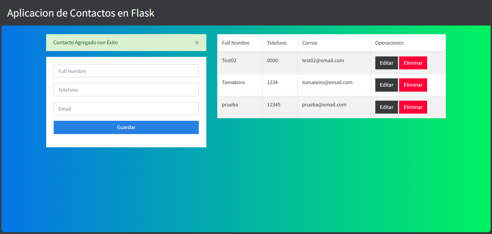

# Aplicación de Contactos con Python Flask y SQL Server

Esta es una aplicación simple de gestión de contactos construida con Python Flask y SQL Server. Permite a los usuarios agregar, editar y eliminar contactos.

## Captura de Pantalla 

## Funcionalidades

- Ver una lista de contactos
- Agregar un nuevo contacto
- Editar un contacto existente
- Eliminar un contacto

## Requisitos  
- Python 3.x 
- Flask 
- pyodbc

## Instalación

- git clone https://github.com/k3v1n-shif/flask_crud_contactos_app.git
- cd flask-crud-contacts-app
- pip install -r requirements.txt
- python app_contacts/app.py

## Uso

-   Accede a la aplicación en tu navegador web visitando `http://localhost:3000`.
-   Utiliza las diferentes opciones del menú para gestionar tus contactos.
